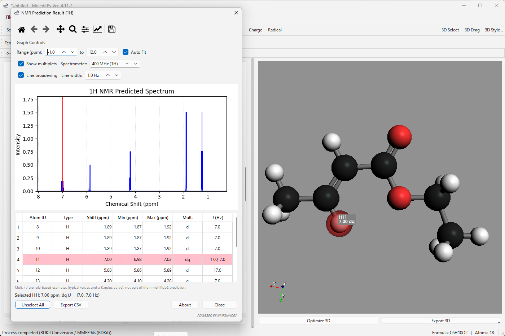
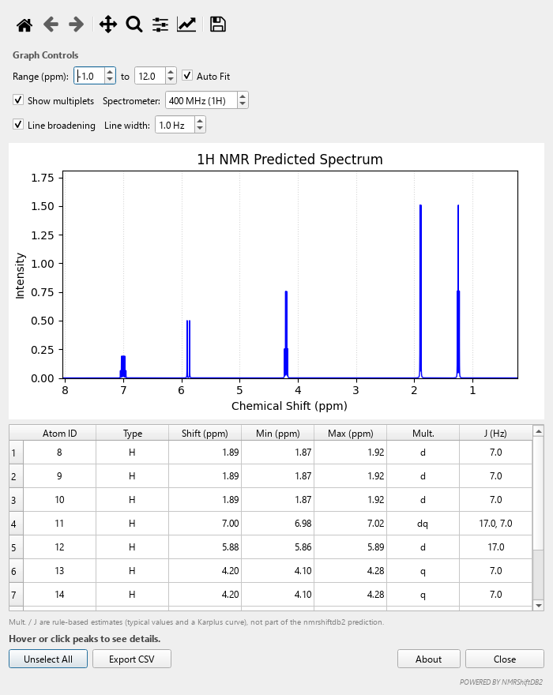

# NMR Prediction Plugin for Moleditpy

A plugin for **Moleditpy** that predicts **1H** and **13C** NMR chemical shifts using the **nmrshiftdb2** machine learning models, and estimates the **coupling pattern** of every signal (s, d, t, q, dd, dq, ... with J in Hz). It provides an interactive spectrum viewer and 3D atom highlighting. Everything runs locally; nothing is sent over the network.

## Features

* **Prediction:** Predict 1H and 13C NMR shifts using the robust `nmrshiftdb2` Java library.
* **Interactive Spectrum:** Visualize the result as a stick spectrum using Matplotlib.
* **3D Visualization:** Hovering over peaks or table rows highlights the corresponding atoms in the Moleditpy 3D view (PyVista).
* **Data Table:** Detailed list of chemical shifts and atom assignments.
* **Coupling estimates** (since 2.5.0): multiplicity and J for every 1H signal, and the carbon multiplicity (s/d/t/q) with 1J(CH) for 13C. The spectrum can show the multiplets split at your spectrometer frequency.
* **Line broadening** (on by default): Lorentzian lines instead of sticks, 1 Hz wide for 1H and 2 Hz for 13C, adjustable or switched off.
* **CSV export** including the multiplicities and J values.

*Ethyl (E)-crotonate as predicted by nmrshiftdb2, with the estimated multiplets: dq 7.00, d 5.88, q 4.20, d 1.89, t 1.24 ppm.*

### How the couplings are estimated

nmrshiftdb2 predicts shifts only. The multiplets come from `coupling.py`, a small rule-based module shared with the [CASCADE predictor](https://github.com/HiroYokoyama/moleditpy_nmr_predictor_cascade): geminal 12 Hz (=CH2 2 Hz), vicinal 7 Hz across a freely rotating bond, a Karplus curve on the 3D dihedral across ring bonds, alkene cis 10 / trans 17 Hz, aromatic ortho 7.5 / meta 1.5 Hz, and 1J(CH) from the hybridisation (125 / 157 / 159 / 249 Hz) plus heteroatom increments. OH/NH/SH protons are treated as exchanging. These are typical values for orientation, not a fit to a measured spectrum; spectra are drawn first-order. The About box shows the shared module version.

## Requirements

* **Moleditpy**: The host application.
* **Java Runtime Environment (JRE)**: Java 8 or later must be installed and added to your system's PATH (required to run the prediction engine).

## Installation

1.  Download the latest `nmr_predicator_nmrshiftdb2.zip` from the [Releases](../../releases) page.
2.  Extract the zip file into the `plugins` directory of your Moleditpy installation.
    * Structure should look like: `.../plugins/nmr_predictor/__init__.py`
3.  Ensure the `lib/` folder inside the plugin directory contains the required JAR files (`predictorh.jar`, `cdk-*.jar`, etc.).

## Usage

1.  Launch Moleditpy and draw or load a molecule.
2.  Go to the menu: **Analysis** > **NMR Prediction (nmrshiftdb2)**.
3.  Select the nucleus (`1H` or `13C`) and click **Predict**.
4.  The result dialog will appear. You can:
    * **Hover** over the graph peaks to see the assignment.
    * **Click** on the table rows to highlight atoms in 3D.
    * Use **Graph Controls** to zoom or auto-scale the spectrum, show or hide the multiplets, set the spectrometer frequency, and change the line broadening.
    * The **Mult.** and **J (Hz)** columns give the estimated coupling pattern.

## Licenses & Credits

This plugin bundles the following third-party libraries. Please refer to the `lib/` directory for full license texts.

### nmrshiftdb2 Predictor
* **Description:** Machine learning based NMR shift prediction.
* **License:** **AGPL v3** (GNU Affero General Public License)
* **Source Code:** [https://sourceforge.net/projects/nmrshiftdb2/](https://sourceforge.net/projects/nmrshiftdb2/)
* **Copyright:** The nmrshiftdb2 Project

### The Chemistry Development Kit (CDK)
* **Description:** Java library for structural chemoinformatics.
* **License:** **LGPL v2.1** (GNU Lesser General Public License)
* **Source Code:** [https://github.com/cdk/cdk](https://github.com/cdk/cdk)
* **Copyright:** The CDK Development Team

### Plugin License
This plugin itself is released under the **GNU General Public License v3 (GPL v3)**.
